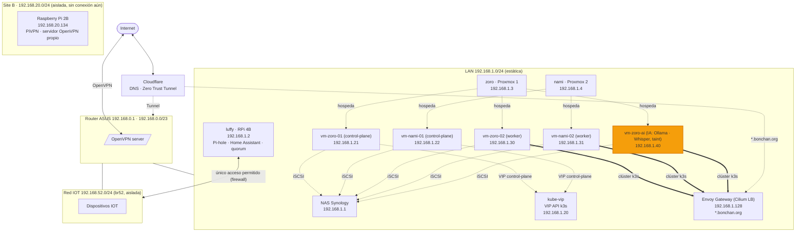
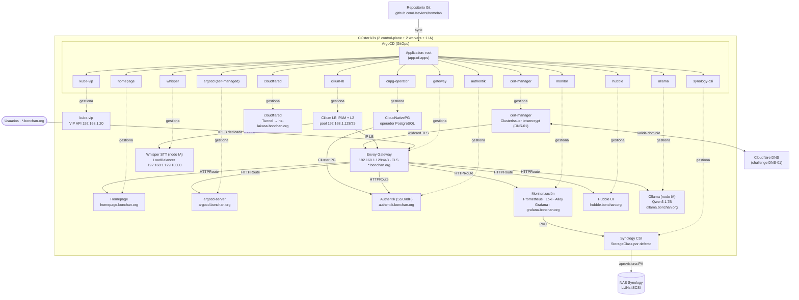

# Homelab — Arquitectura y servicios

Esta documentación describe la disposición actual de la red y servicios del homelab.

## Red y direccionamiento

- CIDR principal: `192.168.0.0/23` (192.168.0.0 – 192.168.1.255), red plana sobre el router ASUS.
- Router ASUS: `192.168.0.1` (gateway por defecto).
- DHCP: `192.168.0.2 - 192.168.0.254`.
- Rango reservado para `LoadBalancer` (Cilium LB IPAM): `192.168.1.128/25` (192.168.1.128 – 192.168.1.255), fuera del DHCP.
- Hosts e infraestructura usan IPs estáticas en `192.168.1.0/24` (ver tablas siguientes).
- Red IOT aislada: `192.168.52.0/24` (bridge `br52` en el router ASUS), separada del resto por firewall (ver [scripts/](scripts/)).
- Red remota aislada (otra ubicación física): `192.168.20.0/24`, ver [Red remota (site B)](#red-remota-site-b) más abajo.

## Hosts y roles

| Host | IP | Hardware | Rol/Descripción |
| --- | --- | --- | --- |
| `nas.bonchan.org` | `192.168.1.1` | Synology DS223J · 2 bahías (1×4 TB, 1 libre) | NAS: almacenamiento e iSCSI (LUNs para el CSI del clúster) |
| `luffy.bonchan.org` | `192.168.1.2` | Raspberry Pi 4B · 8 GB RAM | Pi-hole, Home Assistant + Piper (TTS), quorum (QDevice) de Proxmox |
| `zoro.bonchan.org` | `192.168.1.3` | Geekom A5 · AMD Ryzen 5 7430U · 64 GB RAM | Proxmox Nodo 1 (hospeda `vm-ubuntu26-zoro-01`) |
| `nami.bonchan.org` | `192.168.1.4` | Geekom A5 · AMD Ryzen 5 7430U · 16 GB RAM | Proxmox Nodo 2 (hospeda `vm-ubuntu26-nami-01`) |

> El QDevice de quorum corre en `luffy`: permite que el clúster Proxmox de 2 nodos
> mantenga quorum aunque caiga uno de ellos.

## Lista de servicios

- **Pi-hole** en `luffy.bonchan.org` para DNS local y resolución de dominios internos.
- **Home Assistant** en `luffy.bonchan.org`. Cerebro de la automatización del hogar.
- **Asistente de voz**: **Piper** (TTS) en `luffy.bonchan.org` y **Whisper** (STT) en
  el clúster k3s (nodo de IA), ambos vía protocolo Wyoming, integrados con Home
  Assistant.
- **Proxmox** con dos nodos (`zoro` y `nami`) y quorum que incluye el Raspberry Pi (`luffy`).
- **Clúster k3s** sobre cinco VMs Ubuntu 26 (ver sección siguiente) con todos los
  servicios del homelab gestionados por GitOps (ArgoCD): SSO con Authentik,
  PostgreSQL con CloudNativePG, monitorización (Grafana/Prometheus/Loki/Alloy),
  **Ollama** (Qwen3 1.7B) y **Whisper** en el nodo dedicado de IA, etc.

## Dominio y DNS

- Dominio principal: `bonchan.org` (gestionado en Cloudflare).
- Los dominios locales se resuelven mediante Pi-hole.

## Red remota (site B)

Segunda ubicación física, independiente del domicilio principal, pensada como
futura extensión de la LAN (`192.168.0.0/23`) mediante un túnel VPN site-to-site
(aún no implementado). De momento es una red aislada, sin conexión con el resto
del homelab.

- **Hardware**: Raspberry Pi 2B.
- **Software**: PiVPN con servidor OpenVPN propio, independiente del servidor
  OpenVPN del router ASUS del site principal.
- **Red**: `192.168.20.0/24`.
- **IP de la Raspberry**: `192.168.20.134`.
- **Estado**: sin clientes/peers configurados todavía; sin nombre de host ni
  subdominio `bonchan.org` asignado.

## Acceso remoto

- **VPN**: el router ASUS expone un servidor **OpenVPN**.
- **Cloudflare Zero Trust**: permite exponer servicios de forma segura sin necesidad de abrir puertos en el router, utilizando túneles y autenticación de Cloudflare.

## Clúster k3s

5 VMs Ubuntu 26 repartidas entre los 2 nodos Proxmox forman el clúster k3s, con roles dedicados: 2 control-plane (etcd embebido, sin cargas de trabajo), 2 workers y 1 nodo para IA con taint. Desplegado sin `servicelb`, `traefik`, `local-storage` ni el networking integrado (`flannel`, `kube-proxy` y `network-policy`):

| VM | IP | Nodo Proxmox | VMID | Rol k3s |
| --- | --- | --- | --- | --- |
| `vm-ubuntu26-zoro-01` | `192.168.1.21` | `zoro` | 210 | control-plane (server + etcd), taint `node-role.kubernetes.io/control-plane` |
| `vm-ubuntu26-nami-01` | `192.168.1.22` | `nami` | 220 | control-plane (server + etcd), mismo taint |
| `vm-ubuntu26-zoro-02` | `192.168.1.30` | `zoro` | 211 | worker (agent), sin taint |
| `vm-ubuntu26-nami-02` | `192.168.1.31` | `nami` | 221 | worker (agent), sin taint |
| `vm-ubuntu26-zoro-ai` | `192.168.1.40` | `zoro` | 212 | worker (agent) para IA, taint `dedicated=ai` + label `workload-type=ai` |

> El quorum de etcd es 2/2 (2 nodos control-plane): si cualquiera de los dos cae, el API server se queda sin quorum. Es una limitación conocida y aceptada (sin tercer miembro de etcd) a cambio de mantener solo 2 servidores dedicados a control-plane.
>
> El nodo de IA (`vm-ubuntu26-zoro-ai`, 8 vCPU / 48 GB) solo admite pods que declaren explícitamente `tolerations: [{key: dedicated, operator: Equal, value: ai, effect: NoSchedule}]` y `nodeSelector: {workload-type: ai}` — cualquier despliegue sin esa toleration/selector nunca se programa ahí.

- **kube-vip** publica una VIP de alta disponibilidad para el *control plane* de k3s en `192.168.1.20` (modo ARP, *leader election* entre los nodos control-plane). Es el endpoint estable del API de Kubernetes, registrado en Pi-hole como `kubevip`.
- **Cilium** es el CNI del clúster (dataplane eBPF con *kube-proxy replacement*), sustituyendo a flannel y kube-proxy. Lo instala el rol de Ansible `install-k3s` vía Helm, no GitOps (es la red que el resto necesita para arrancar). Tolera todos los taints (`tolerations: [{operator: Exists}]`) para correr también en los 2 nodos control-plane y en el nodo de IA.
- **Cilium LB IPAM + L2 announcements** asigna IPs `LoadBalancer` del rango reservado `192.168.1.128/25` (192.168.1.128 – 192.168.1.255), sustituyendo a MetalLB. El pool y la política L2 se definen en `services/cilium-lb/`.
- **Cifrado pod-to-pod con WireGuard** habilitado en Cilium: el tráfico entre pods de distintos nodos viaja cifrado de forma transparente, sin gestión manual de claves.
- **Envoy Gateway** (Gateway API) es el único punto de entrada HTTP/HTTPS del clúster: tiene la IP `192.168.1.128` y termina TLS para `*.bonchan.org` con un certificado wildcard emitido por cert-manager. El resto de servicios se publican como `HTTPRoute` bajo subdominios (p. ej. `argocd.bonchan.org`, `homepage.bonchan.org`).
- **ArgoCD** gestiona las aplicaciones del clúster vía GitOps desde este repositorio con un patrón *app-of-apps* y se expone a través del Gateway en `argocd.bonchan.org`.
- **cert-manager** emite los certificados Let's Encrypt mediante challenge DNS-01 contra Cloudflare.
- **Synology CSI** aprovisiona volúmenes persistentes (LUNs iSCSI) dinámicamente desde el NAS.
- **CloudNativePG (CNPG)** es el operador de PostgreSQL: cada servicio que necesita base de datos declara su propio `Cluster` (p. ej. el de Authentik).
- **Authentik** es el proveedor de identidad (SSO/IdP) del homelab, en `authentik.bonchan.org`, con su PostgreSQL dedicado gestionado por CNPG.
- **Monitorización**: **Prometheus** (métricas), **Loki** (logs), **Alloy** (recolección de logs) y **Grafana** (dashboards y alertas) en `grafana.bonchan.org`.
- **Homepage** es el portal/dashboard del homelab en `homepage.bonchan.org`, con autodescubrimiento de servicios.
- **Ollama** en el nodo de IA sirve **Qwen3 1.7B** (Q4_K_M, sin *thinking*) para *tool calling* desde Home Assistant, expuesto en `ollama.bonchan.org`. Se eligió este tamaño tras medir en el hardware real (CPU sin GPU) que el 4B rendía solo ~10 tokens/s frente a ~20 tokens/s del 1.7B, con la misma precisión de *tool calling* en las pruebas realizadas.
- **Whisper** (STT, protocolo Wyoming) corre también en el nodo de IA con una IP `LoadBalancer` dedicada (`192.168.1.129`), reemplazando al Whisper que antes corría en `luffy`; Piper (TTS) sigue en `luffy`.
- **Cloudflare Tunnel** (`cloudflared`) expone servicios a internet sin abrir puertos en el router: Home Assistant vía `hs-lakasa.bonchan.org` (túnel locally-managed con reglas en git).
- **Hubble** (relay + UI) da observabilidad de red sobre eBPF en `hubble.bonchan.org`, protegido por OIDC.

## Estructura del repositorio

| Carpeta | Contenido |
| --- | --- |
| [packer/](packer/) | Template de Ubuntu 26 para Proxmox (autoinstall + provisión con Ansible). |
| [terraform/](terraform/proxmox-vm/) | Despliegue de las VMs del clúster desde el template (`proxmox-vm` como root module, `modules/proxmox-vm` como módulo reutilizable versionado). |
| [ansible/](ansible/) | Playbooks y roles: configuración de Proxmox y quorum (QDevice), actualización de paquetes, instalación/desinstalación de k3s, preparación del template de Packer y despliegue de los servicios de `luffy` (Pi-hole, Home Assistant y Piper) vía Docker Compose. |
| [services/](services/) | Manifiestos GitOps de los servicios del clúster gestionados por ArgoCD (kube-vip, Cilium LB IPAM, ArgoCD, cert-manager, Envoy Gateway API, Homepage, Synology CSI, CNPG, Authentik, monitorización, Ollama, Whisper). |
| [old_services/](old_services/) | Servicios retirados, conservados como referencia y **no** gestionados por ArgoCD (p. ej. MetalLB, sustituido por Cilium LB IPAM). |
| [scripts/](scripts/) | Scripts auxiliares: DDNS contra Cloudflare y firewall de la red IOT en el router. |
| [docs/](docs/) | Documentación operativa: runbooks (manuales paso a paso) y postmortems *blameless*. |

## Flujo de despliegue

1. **Proxmox** (`ansible/playbooks/qdevice.yml`): configura los repos sin suscripción y el QDevice de quorum (árbitro en `luffy`).
2. **Packer** (`packer/ubuntu26`): construye el template `ubuntu26-template` en Proxmox.
3. **Terraform** (`terraform/proxmox-vm`): clona el template y crea las dos VMs del clúster con cloud-init.
4. **Ansible** (`ansible/playbooks/install-k3s.yml`): instala k3s en las VMs, despliega Cilium y descarga el kubeconfig.
5. **Servicios** (`services/`): se aplican manualmente el pool de Cilium LB (`services/cilium-lb`) y ArgoCD; después se registra la `Application` raíz (*app-of-apps*) y ArgoCD sincroniza el resto de servicios desde este repositorio.
6. **Servicios de `luffy`** (`ansible/playbooks/home-services.yml`): despliega Pi-hole, Home Assistant y Piper en la Raspberry.

El procedimiento completo paso a paso está en el runbook
[docs/runbooks/00-bootstrap-homelab.md](docs/runbooks/00-bootstrap-homelab.md).
Cada carpeta tiene además su propio README con el detalle de uso.

## Diagrama de red

> El acceso a internet de la IOT y el tráfico desde/hacia el resto de la LAN están bloqueados por iptables en el router; solo Home Assistant (`luffy`) puede comunicarse con ella (ver [scripts/firewall-start.sh](scripts/firewall-start.sh)).
>
> El **Site B** (`192.168.20.0/24`) es una segunda ubicación física con su propio servidor OpenVPN (PiVPN), sin ningún enlace todavía con el resto del homelab; ver [Red remota (site B)](#red-remota-site-b).

## Diagrama del clúster y servicios

