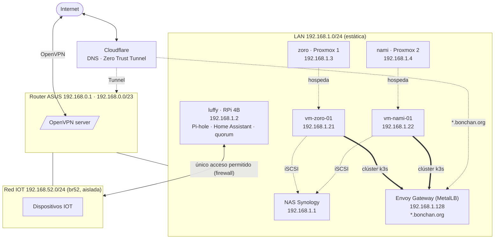
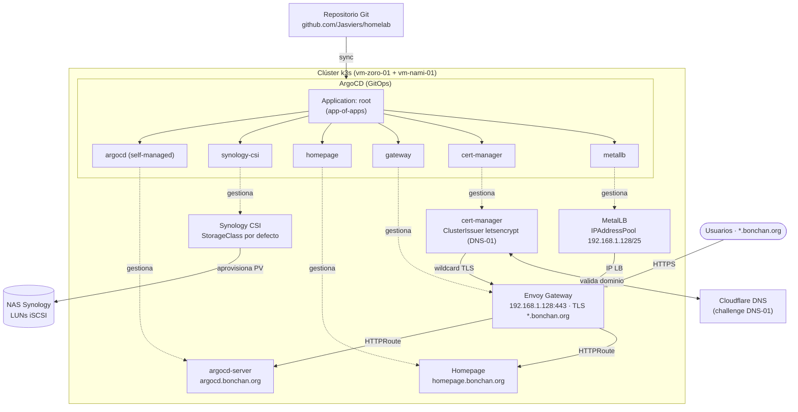

# Homelab — Arquitectura y servicios

Esta documentación describe la disposición actual de la red y servicios del homelab.

## Red y direccionamiento

- CIDR principal: `192.168.0.0/23` (192.168.0.0 – 192.168.1.255), red plana sobre el router ASUS.
- Router ASUS: `192.168.0.1` (gateway por defecto).
- DHCP: `192.168.0.2 - 192.168.0.254`.
- Rango reservado para `LoadBalancer` (MetalLB): `192.168.1.128/25` (192.168.1.128 – 192.168.1.255), fuera del DHCP.
- Hosts e infraestructura usan IPs estáticas en `192.168.1.0/24` (ver tablas siguientes).
- Red IOT aislada: `192.168.52.0/24` (bridge `br52` en el router ASUS), separada del resto por firewall (ver [scripts/](scripts/)).

## Hosts y roles

| Host | IP | Rol/Descripción |
| --- | --- | --- |
| `nas.bonchan.org` | `192.168.1.1` | NAS Synology (almacenamiento) |
| `luffy.bonchan.org` | `192.168.1.2` | Raspberry Pi 4B (Pi-hole, Home Assistant, quorum Proxmox) |
| `zoro.bonchan.org` | `192.168.1.3` | Proxmox Nodo 1 |
| `nami.bonchan.org` | `192.168.1.4` | Proxmox Nodo 2 |

## Lista de servicios

- **Pi-hole** en `luffy.bonchan.org` para DNS local y resolución de dominios internos.
- **Home Assistant** en `luffy.bonchan.org`. Cerebro de la automatización del hogar.
- **Proxmox** con dos nodos (`zoro` y `nami`) y quorum que incluye el Raspberry Pi (`luffy`).

## Dominio y DNS

- Dominio principal: `bonchan.org` (gestionado en Cloudflare).
- Los dominios locales se resuelven mediante Pi-hole.

## Acceso remoto

- **VPN**: el router ASUS expone un servidor **OpenVPN**.
- **Cloudflare Zero Trust**: permite exponer servicios de forma segura sin necesidad de abrir puertos en el router, utilizando túneles y autenticación de Cloudflare.

## Clúster k3s

Dos VMs Ubuntu 26 (una por nodo Proxmox) forman un clúster k3s con etcd embebido, desplegado sin `servicelb`, `traefik`, `local-storage` ni el networking integrado (`flannel`, `kube-proxy` y `network-policy`):

| VM | IP | Nodo Proxmox | VMID |
| --- | --- | --- | --- |
| `vm-ubuntu26-zoro-01` | `192.168.1.21` | `zoro` | 210 |
| `vm-ubuntu26-nami-01` | `192.168.1.22` | `nami` | 220 |

- **Cilium** es el CNI del clúster (dataplane eBPF con *kube-proxy replacement*), sustituyendo a flannel y kube-proxy. Lo instala el rol de Ansible `install-k3s` vía Helm, no GitOps (es la red que el resto necesita para arrancar).
- **MetalLB** asigna IPs `LoadBalancer` del rango reservado `192.168.1.128/25` (192.168.1.128 – 192.168.1.255).
- **Envoy Gateway** (Gateway API) es el único punto de entrada HTTP/HTTPS del clúster: tiene la IP `192.168.1.128` y termina TLS para `*.bonchan.org` con un certificado wildcard emitido por cert-manager. El resto de servicios se publican como `HTTPRoute` bajo subdominios (p. ej. `argocd.bonchan.org`, `homepage.bonchan.org`).
- **ArgoCD** gestiona las aplicaciones del clúster vía GitOps desde este repositorio con un patrón *app-of-apps* y se expone a través del Gateway en `argocd.bonchan.org`.
- **cert-manager** emite los certificados Let's Encrypt mediante challenge DNS-01 contra Cloudflare.
- **Synology CSI** aprovisiona volúmenes persistentes (LUNs iSCSI) dinámicamente desde el NAS.

## Estructura del repositorio

| Carpeta | Contenido |
| --- | --- |
| [packer/](packer/) | Template de Ubuntu 26 para Proxmox (autoinstall + provisión con Ansible). |
| [terraform/](terraform/proxmox-vm/) | Despliegue de las VMs del clúster desde el template (`proxmox-vm` como root module, `modules/proxmox-vm` como módulo reutilizable versionado). |
| [ansible/](ansible/) | Playbooks y roles: actualización de paquetes, instalación/desinstalación de k3s y preparación del template de Packer. |
| [services/](services/) | Manifiestos GitOps de los servicios del clúster gestionados por ArgoCD (MetalLB, ArgoCD, cert-manager, Envoy Gateway API, Homepage, Synology CSI). |
| [docker-composes/](docker-composes/) | Servicios que corren en `luffy` con Docker Compose (Pi-hole, Home Assistant). |
| [scripts/](scripts/) | Scripts auxiliares: DDNS contra Cloudflare y firewall de la red IOT en el router. |
| [docs/](docs/) | Documentación operativa: runbooks (manuales paso a paso) y postmortems *blameless*. |
| `temp/` | Material en transición, pendiente de migrar a `services/`. |

## Flujo de despliegue

1. **Packer** (`packer/ubuntu26`): construye el template `ubuntu26-template` en Proxmox.
2. **Terraform** (`terraform/proxmox-vm`): clona el template y crea las dos VMs del clúster con cloud-init.
3. **Ansible** (`ansible/playbooks/install-k3s.yml`): instala k3s en las VMs y descarga el kubeconfig.
4. **Servicios** (`services/`): se aplican manualmente MetalLB y ArgoCD; después se registra la `Application` raíz (*app-of-apps*) y ArgoCD sincroniza el resto de servicios desde este repositorio.

Cada carpeta tiene su propio README con el detalle de uso.

## Diagrama de red

> El acceso a internet de la IOT y el tráfico desde/hacia el resto de la LAN están bloqueados por iptables en el router; solo Home Assistant (`luffy`) puede comunicarse con ella (ver [scripts/firewall-start.sh](scripts/firewall-start.sh)).

## Diagrama del clúster y servicios

